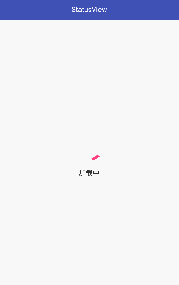

# StatusView：简单的 Android 页面多状态布局切换控件

[StatusView Demo 体验](https://fir.im/3y8x?release_id=5bb05700959d694dd3e7169b)
### 一、效果预览

### 二、主要功能
* 可在 Activity、Fragment 、XML 中使用，可作用于 XML 的根布局 View 或其子 View
* 默认支持 Loading、Empty、Error 三种状态布局，可进行常规配置
* 可自定义状态布局，并提供对应接口来完成需要的配置
* 状态布局懒加载，仅在初次显示时初始化

### 三、使用
##### 1、添加依赖
```java
allprojects {
    repositories {
        ...
        maven { url 'https://jitpack.io' }
    }
}
```
```java
dependencies {
    implementation 'com.github.SheHuan:StatusView:1.0.2'
}
```
##### 2、初始化
可以直接在 XML 中初始化：
```java
<com.shehuan.statusview.StatusView
    android:layout_width="match_parent"
    android:layout_height="match_parent">

    <!--your layout-->

</com.shehuan.statusview.StatusView>
```
也可以在 Activity、Fragment中初始化：
```java
// 作用于 Activity 根布局 View
statusView = StatusView.init(Activity activity);
// 作用于 Activity 布局文件中指定的 View
statusView = StatusView.init(Activity activity, @IdRes int viewId);
// 作用于 Fragment 布局文件中指定的 View
statusView = StatusView.init(Fragment fragment, @IdRes int viewId);
```
注意事项：
* 当 Fragment 布局文件的根 View 使用 StatusView 时，为避免出现的异常问题，建议在 XML 中初始化！
* 当直接在 Fragment 中使用时，`init()`方法需要在`onCreateView()`之后的生命周期方法中执行！
##### 3、配置
如果使用默认的状态布局，可以通过如下方式配置布局：
```java
statusView.config(new StatusViewBuilder.Builder()
                .setLoadingTip() // loading 提示信息
                .setEmptyip() // empty 提示信息
                .setErrorTip() // error 提示信息
                .setTipColor() // 提示信息颜色
                .setTipSize() // 提示信息字体大小
                .setEmptyIcon() // empty 图标
                .setErrorIcon() // error 图标
                .showEmptyRetry() // 是否显示 empty 重试按钮
                .showErrorRetry() // 是否显示 error 重试按钮
                .setEmptyRetryText() // empty 重试按钮文字
                .setErrorRetryText() // error 重试按钮文字
                .setRetryColor() // 重试按钮文字颜色
                .setRetrySize() // 重试按钮字体大小
                .setRetryDrawable() // 重试按钮 drawable 背景
                .setOnEmptyRetryClickListener(new View.OnClickListener() {
                    @Override
                    public void onClick(View view) {
                        // empty 重试按钮点击事件
                    }
                })
                .setOnErrorRetryClickListener(new View.OnClickListener() {
                    @Override
                    public void onClick(View v) {
                        // error 重试按钮点击事件
                    }
                })
                .build());
```

如果需要使用自定义状态布局，可以通过如下方式设置：
```java
statusView.setLoadingView(@LayoutRes int layoutId);
statusView.setEmptyView(@LayoutRes int layoutId);
statusView.setErrorView(@LayoutRes int layoutId);
```
或者在 XML 通过自定义属性配置，自定义属性的声明如下
```java
<declare-styleable name="StatusView">
    <attr name="sv_loading_view" format="reference" />
    <attr name="sv_empty_view" format="reference" />
    <attr name="sv_error_view" format="reference" />
</declare-styleable>
```
使用自定义状态布局时，如果需要进行一些配置可通过`statusView.setOnXXXViewConvertListener()`系列方法来完成，例如：
```java
statusView.setOnErrorViewConvertListener(new StatusViewConvertListener() {
    @Override
    public void onConvert(ViewHolder viewHolder) {

    }
});
```
##### 4、切换状态布局
```java
statusView.showLoadingView();
statusView.showEmptyView();
statusView.showErrorView();
statusView.showContentView(); // 即原始的页面内容布局
```
##### 5、更自由的用法
如果不想局限于 Loading、Empty、Error 三种状态，那么下面的用法会更适合你：
```java
// 添加指定索引对应的状态布局
statusView.setStatusView(int index, @LayoutRes int layoutId)
// 为指定索引的状态布局设置初次显示的监听事件，用来进行状态布局的相关初始化
statusView.setOnStatusViewConvertListener(int index, StatusViewConvertListener listener)
// 显示指定索引的状态布局
statusView.showStatusView(int index)
```

更多使用细节可参考demo！